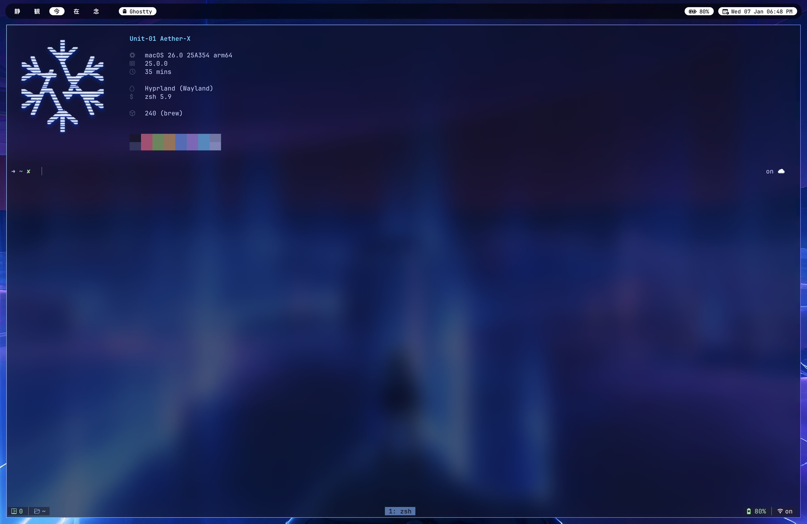
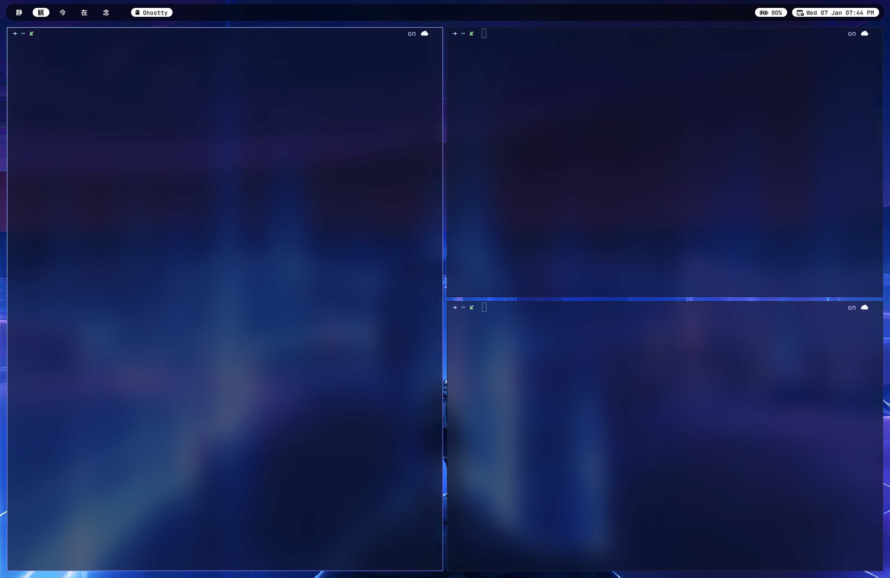
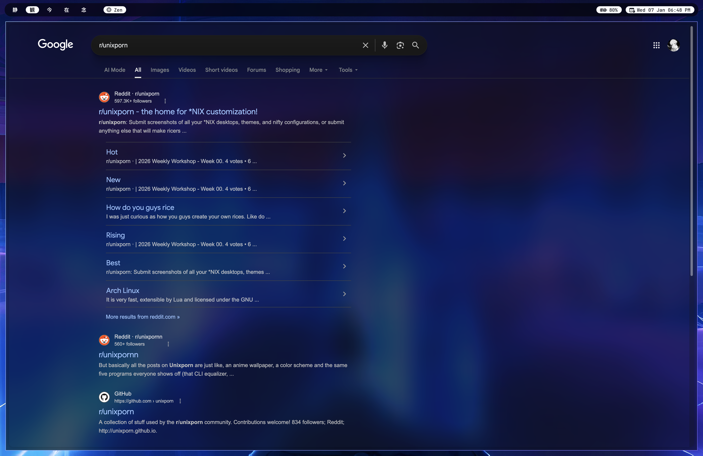
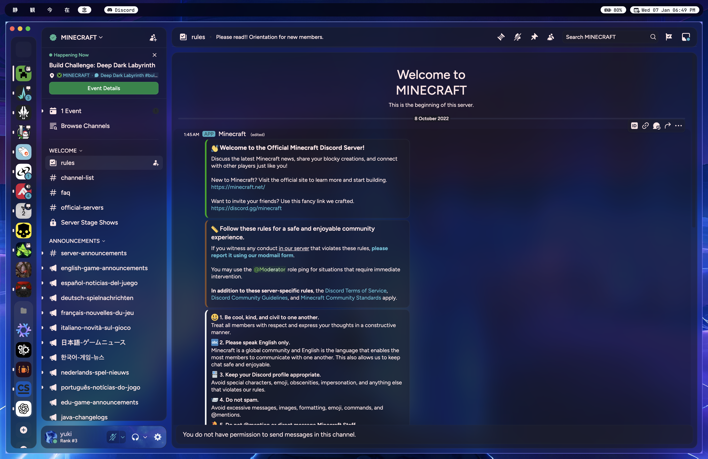
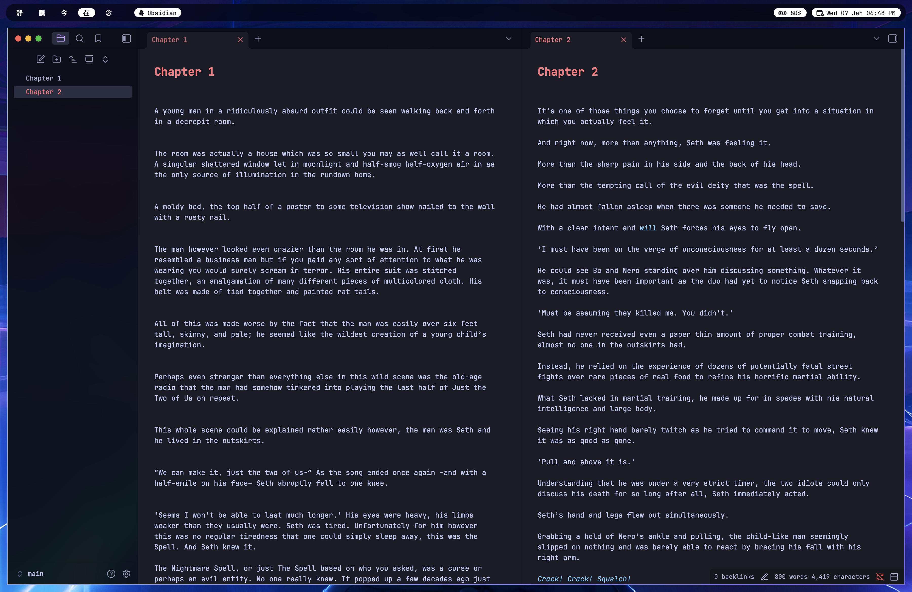

# Hyprland-Inspired macOS Rice

A heavily **min-maxed macOS setup** inspired by Hyprland —  
fast, minimal, animation-light, and information-dense.

Designed to feel **immediate**, **clean**, and **intentional**.

---

## Installation

```bash
git clone https://github.com/ishn-n-personal/dotfiles.git ~/dotfiles
cd ~/dotfiles
./scripts/install.sh
```

---

## Desktop


---

## Terminal (Ghostty)



---

## Browser / Real-World Apps


---

## Communication


---

## Focus / Writing


---

## Stack
- **WM:** yabai (BSP)
- **Hotkeys:** skhd
- **Bar:** sketchybar
- **Terminal:** Ghostty
- **Shell:** zsh + starship
- **Borders:** Janky Borders
- **Fetch:** neofetch (chafa image backend)

---

## Highlights
- Hyprland-style tiling & gaps
- Zero-jank window behavior
- Cursor-only terminal animations
- Clean, distraction-free bar
- Login-only neofetch (keeps it premium)
- Modular, symlink-based dotfiles

---

## Notes
- Paths may need adjustment depending on the system
- macOS scripting addition required for yabai
- Ghostty shaders are optional and fully modular
- Installer is safe to re-run (backs up existing files)
